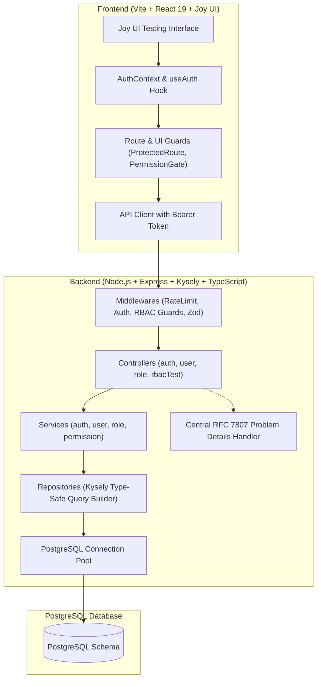
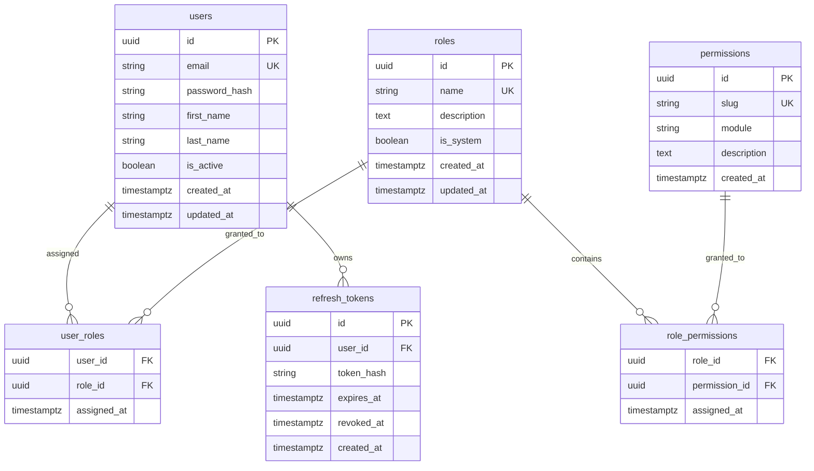

# Production-Ready RBAC Boilerplate Documentation

An enterprise-grade Role-Based Access Control (RBAC) architecture built with **Node.js, Express, Kysely, and PostgreSQL** on the backend, and **React 19, TypeScript, and Joy UI** on the frontend.

---

## 1. System Architecture



---

## 2. Database Schema & ERD



---

## 3. Seeded Default Roles & Permissions Matrix

| Permission Slug | Module | Super Admin | Admin | Manager | User | Description |
| :--- | :--- | :---: | :---: | :---: | :---: | :--- |
| `users:read` | Users | ✅ *(Universal)* | ✅ | ✅ | ❌ | View user list & profiles |
| `users:create` | Users | ✅ *(Universal)* | ✅ | ❌ | ❌ | Create new user accounts |
| `users:update` | Users | ✅ *(Universal)* | ✅ | ❌ | ❌ | Edit user details & roles |
| `users:delete` | Users | ✅ *(Universal)* | ✅ | ❌ | ❌ | Deactivate or delete accounts |
| `roles:read` | Roles | ✅ *(Universal)* | ✅ | ❌ | ❌ | View roles and assigned permissions |
| `roles:manage` | Roles | ✅ *(Universal)* | ❌ | ❌ | ❌ | Modify permissions on roles |
| `analytics:read` | Analytics | ✅ *(Universal)* | ✅ | ✅ | ❌ | View system metrics and audit telemetry |
| `settings:read` | Settings | ✅ *(Universal)* | ✅ | ✅ | ✅ | View application settings |
| `settings:manage`| Settings | ✅ *(Universal)* | ❌ | ❌ | ❌ | Mutate system runtime parameters |

---

## 4. Pre-Configured Demo Accounts

All demo accounts share the initial password: `Password123!`

| Role Persona | Email | Access Scope |
| :--- | :--- | :--- |
| **👑 Super Admin** | `superadmin@example.com` | Unrestricted master access across all routes and resources. |
| **🛡️ Administrator** | `admin@example.com` | User management (`users:*`), role viewing, analytics, read settings. |
| **💼 Manager** | `manager@example.com` | User reading (`users:read`), analytics (`analytics:read`), read settings. |
| **👤 Standard User** | `user@example.com` | Base authenticated identity (`settings:read` only). |

---

## 5. Quickstart Guide

### Step 1: Start PostgreSQL
Launch a clean PostgreSQL 16 container with the provided docker-compose configuration:
```bash
docker compose up -d
```

### Step 2: Migrate & Seed the Database
From the `database/` directory:
```bash
cd database
npm run migrate
npm run seed
```
*(Or directly from the project root: `npm run db:migrate` and `npm run db:seed`)*

### Step 3: Start the Servers
In terminal 1 (Backend API):
```bash
cd backend
npm run dev
# Running on http://localhost:5000
```

In terminal 2 (Frontend Client):
```bash
cd frontend
npm run dev
# Running on http://localhost:5173
```

---

## 6. Developer Integration Guide

### Guarding Backend Routes (Express)

#### Enforce Role Possession:
```typescript
import { requireRole } from '../middlewares/auth/authorization.middleware.js';

// Accessible only by super_admin and admin (super_admin always bypasses)
router.get('/admin/audit', requireRole('super_admin', 'admin'), auditController);
```

#### Enforce Fine-Grained Permissions:
```typescript
import { requirePermission } from '../middlewares/auth/authorization.middleware.js';

// Accessible only by users who hold the 'users:create' permission
router.post('/users', requirePermission('users:create'), userController.createUser);
```

---

### Guarding Frontend UI Elements & Routes (React)

#### Route Guarding:
```tsx
<Route
  path="users"
  element={
    <ProtectedRoute requiredPermission="users:read">
      <UsersPage />
    </ProtectedRoute>
  }
/>
```

#### Declarative Component Gate:
```tsx
import PermissionGate from '@/hocs/PermissionGate';

// Conditionally render button or render it disabled with a tooltip
<PermissionGate permission="users:delete" disableOnly>
  <Button colorScheme="error">Delete User</Button>
</PermissionGate>
```

#### Programmatic Evaluation with `useAuth`:
```tsx
const { hasPermission, hasRole } = useAuth();

if (hasPermission('analytics:read')) {
  // Show analytics widget
}
```
